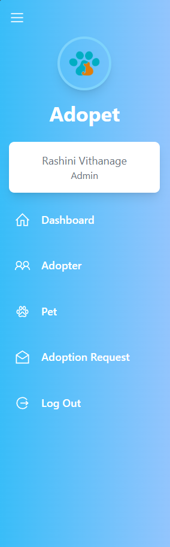

# Adopet Web application 🐶🐱

Adopet is a comprehensive web application designed to facilitate the pet adoption process. It connects pet lovers with animals in need of new homes while providing an intuitive platform for managing pet profiles, adoption requests, and adopter information. Built with a modern tech stack, Adopet leverages React for the frontend and Node.js for the backend, ensuring a responsive and scalable user experience.

The system is structured to handle the following core features:

- Pet Management: Add, update, view, and delete pet profiles, including detailed information such as age, breed, health status, and images.
- Adopter Management: Manage adopter profiles, including personal details and adoption history.
- Adoption Requests: Submit and track adoption requests, including their approval status and associated pet.
- Pet Adoption Process: Facilitate the process from pet viewing to adoption confirmation, ensuring transparency and efficient communication between adopters and admins.

## Features

### Pet Management:
- **Save Pet:** Add new entries effortlessly.
- **Get Pet:** Quickly search for pet details.
- **Update Pet:** Update existing pet information.
- **Delete Pet:** Delete pet records as needed.

### Adopter Management:
- **Save Adopter:** Add new Adopters in to system.
- **Get Adopter:** Search and retrieve Adopter details.
- **Update Adopter:** Update information for existing adopters.
- **Delete Adopter:** Remove adopters from the application with ease.

### Adoption Request Management:
- **Save Adoption Requests:** Create and process new requests.
- **Get All Requests:** Review and manage all existing requests.
- **Approve Adoption:** Allows the administrator to review and approve an adoption request.
- **Reject Adoption:** Enables the administrator to decline an adoption request due to reasons like incomplete documentation, adopter unsuitability, or the pet’s unavailability.

## Technologies Used (Client Server Architecture)

**Frontend:** React, TypeScript, Redux, Redux Thunk

**Backend:** Node.js, Express.js

**Authentication:** JWT-based authentication

**Database & ORM:** MySQL, Prisma ORM

**State Management:** Redux with Redux Thunk

**API Development:** RESTful APIs using Express.js

**File Handling:** Cloud storage for pet image uploads

## Controllers & Endpoints  

### **Pet Controller**  
- **Save Pet:** `POST /pet` - Add a new pet for adoption.  
- **Update Pet:** `PUT /pet/{id}` - Update pet information.  
- **Delete Pet:** `DELETE /pet/{id}` - Remove a pet from the system.  
- **Get All Pets:** `GET /pet` - Fetch a list of all pets available for adoption.  

### **Adopter Controller**  
- **Save Adopter:** `POST /adopter` - Register a new adopter.  
- **Update Adopter:** `PUT /adopter/{id}` - Update adopter information.  
- **Delete Adopter:** `DELETE /adopter/{id}` - Remove an adopter profile.  
- **Get All Adopters:** `GET /adopter` - Get a list of all registered adopters.  

### **Adoption Request Controller**  
- **Save Adoption Request:** `POST /adoption-request` - Submit a new adoption request.   
- **Approve Adoption Request:** `PUT /adoption-request/approve/{id}` - Approve an adoption request.  
- **Reject Adoption Request:** `PUT /adoption-request/reject/{id}` - Reject an adoption request.  
- **Get All Adoption Requests:** `GET /adoption-request` - Fetch a list of all adoption requests.  

### **Authentication Controller**  
- **User Signup:** `POST /auth/signup` - Register a new user (adopter/admin).  
- **User Login:** `POST /auth/login` - Authenticate user and generate JWT token.  
- **Get Current Users:** `GET /auth/` - Retrieve details of the logged-in users.
## Getting Started

1. Clone the Repository: Run git clone https://github.com/rashiniashinsana/pet-adoption-frontend for frontend and https://github.com/rashiniashinsana/adopet-backend for backend to get the source code.

2. Set Up the Database: Configure your database settings in the `.env` file, including MySQL connection details for Prisma ORM. Run `npx prisma migrate dev` to apply migrations.

3. Build and Run: Start the backend server using `npm run dev` for development mode. For the frontend, navigate to the React project folder and `run npm start` to launch the application.
## API Documentation

For comprehensive API endpoints and usage instructions, please check out the [Postman Documentation](https://documenter.getpostman.com/view/36642476/2sAYdfrBv7).
## License

This project is licensed under the MIT License. For more information, view the LICENSE file.

## Screenshots

### Login Page

### SignUp Page

### Dashboard

### MenuBar

### Adopter Page

### Adoption Request Page

### Pet Card

